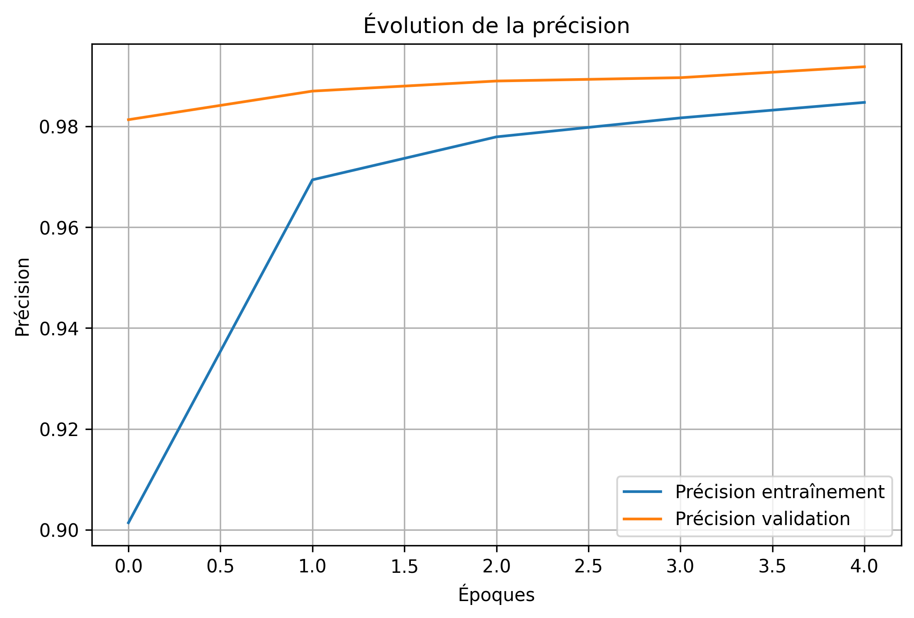
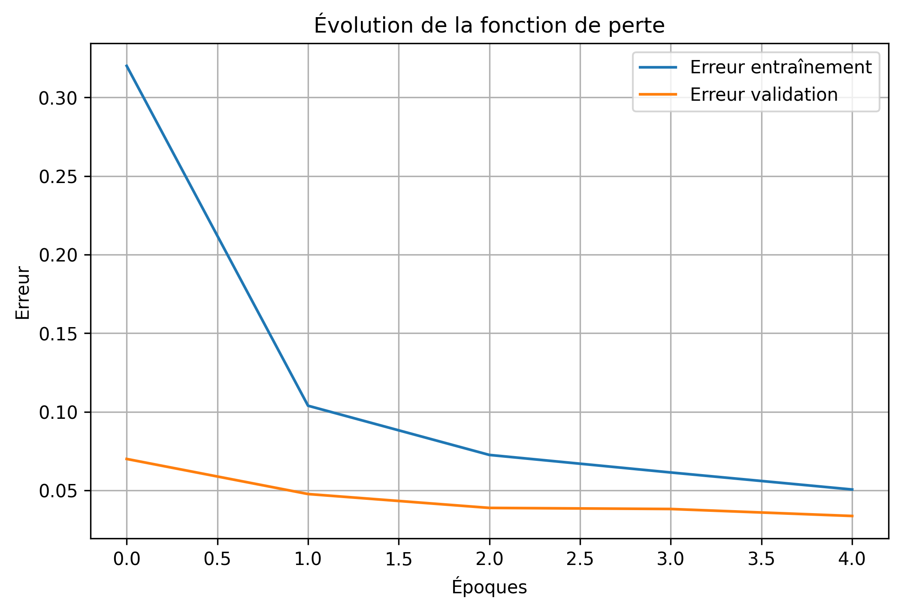
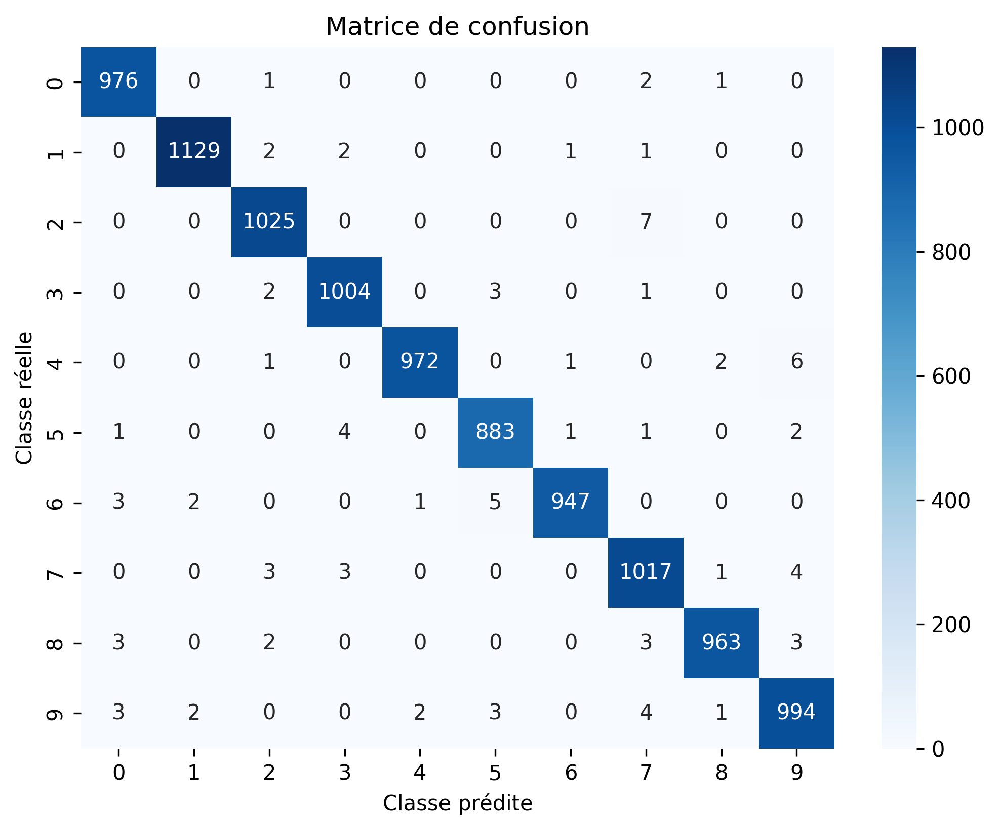
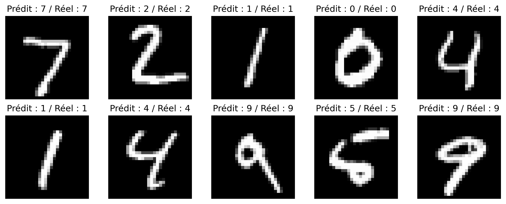

# CNN for Handwritten Digit Classification — MNIST

## 📌 Project Overview

This project was developed as part of my **Master 1 academic work in Applied Mathematics**.

The objective is to study **Convolutional Neural Networks (CNNs)** and implement a deep learning model capable of automatically classifying handwritten digits from **0 to 9** using the MNIST dataset.

The project covers the main stages of a deep learning workflow:

- Data loading and exploration
- Image preprocessing
- CNN architecture design
- Model training and validation
- Performance evaluation
- Error analysis using a confusion matrix
- Prediction visualization
- Model saving and reloading

The final CNN achieved approximately **98.9% accuracy on the MNIST test set**.

---

## 📊 Dataset

The project uses the **MNIST handwritten digit dataset**, composed of grayscale images representing digits from 0 to 9.

- **60,000** training images
- **10,000** test images
- Image size: **28 × 28 pixels**
- **10 classes** (digits 0–9)

### Data Preprocessing

Before training the model:

- Pixel values were normalized from `[0, 255]` to `[0, 1]`.
- Images were reshaped to `(28, 28, 1)` to match the CNN input format.
- Labels were converted into categorical vectors using one-hot encoding.

---

## 🧠 CNN Architecture

The model was implemented using **TensorFlow/Keras** with the following architecture:

```text
Input: 28 × 28 × 1
        │
        ▼
Conv2D — 32 filters, 3×3, ReLU
        │
        ▼
MaxPooling2D — 2×2
        │
        ▼
Conv2D — 64 filters, 3×3, ReLU
        │
        ▼
MaxPooling2D — 2×2
        │
        ▼
Flatten
        │
        ▼
Dense — 128 neurons, ReLU
        │
        ▼
Dropout — 0.5
        │
        ▼
Dense — 10 neurons, Softmax
        │
        ▼
Predicted digit (0–9)
```

The convolutional layers automatically learn relevant visual features from the images, while the fully connected layers perform the final classification.

A **Dropout layer (0.5)** is used to reduce overfitting.

---

## ⚙️ Model Training

The model was trained using the following configuration:

- **Optimizer:** Adam
- **Loss function:** Categorical Cross-Entropy
- **Epochs:** 5
- **Batch size:** 128
- **Validation split:** 10%

During training, both accuracy and loss were monitored on the training and validation sets to analyze the learning process and model generalization.

---

## 📈 Model Evaluation

After training, the model was evaluated on the **10,000 test images**, which were not used during training.

The evaluation includes:

- Test accuracy and loss
- Training and validation accuracy curves
- Training and validation loss curves
- Confusion matrix
- Precision, recall and F1-score
- Visualization of individual predictions

---

## 🎯 Results

The trained CNN achieved approximately:

### **98.9% test accuracy**

This corresponds to approximately **9,890 correctly classified images out of 10,000 test images**.

The confusion matrix shows that the majority of predictions are located on the main diagonal, indicating correct classification.

The remaining errors mainly concern handwritten digits with visually similar shapes.

---

## 📊 Visual Results

### Training and Validation Accuracy



### Training and Validation Loss



### Confusion Matrix



### Prediction Examples



---

## 💾 Model Persistence

After training, the model is saved using the native Keras format:

```python
model.save("modele_cnn_mnist.keras")
```

The saved model can then be reloaded without retraining:

```python
from tensorflow.keras.models import load_model

model = load_model("modele_cnn_mnist.keras")
```

---

## 🛠️ Technologies

- **Python**
- **TensorFlow / Keras**
- **NumPy**
- **Scikit-learn**
- **Matplotlib**
- **Seaborn**
- **Google Colab**

---

## 📁 Repository Structure

```text
cnn-mnist-classification/
│
├── README.md
├── Application_CNN_MNIST.ipynb
│
├── docs/
│   ├── Rapport_CNN_MNIST.pdf
│   └── Presentation_CNN_MNIST.pdf
│
└── figures/
    ├── images_mnist.png
    ├── courbe_precision.png
    ├── courbe_erreur.png
    ├── matrice_confusion.png
    └── predictions_mnist.png
```

---

## 📚 Academic Context

This project was completed during the **2025–2026 academic year** as part of my **Master 1 studies in Applied Mathematics**.

The work combines a theoretical study of artificial neural networks and convolutional neural networks with a practical implementation of a CNN for handwritten digit classification.

The complete academic report and presentation are available in the [`docs`](./docs/) directory.

---

## 👥 Authors

**Naima Assoulaimani**  
**Khadija Darid**

Supervised by **M. Makhlouf Abdenacer**

---

## 🎓 Key Learning Outcomes

Through this project, I developed practical experience in:

- Understanding the mathematical principles behind neural networks and CNNs
- Preparing image datasets for deep learning
- Designing and training a convolutional neural network
- Monitoring training and validation performance
- Evaluating a classification model
- Using confusion matrices and classification metrics
- Analyzing prediction errors
- Visualizing model performance
- Saving and reloading trained deep learning models

---

## 📄 Documentation

- [Full Project Report](docs/Rapport_CNN_MNIST.pdf)
- [Project Presentation](docs/Presentation_CNN_MNIST.pdf)
- [Jupyter Notebook](Application_CNN_MNIST.ipynb)
